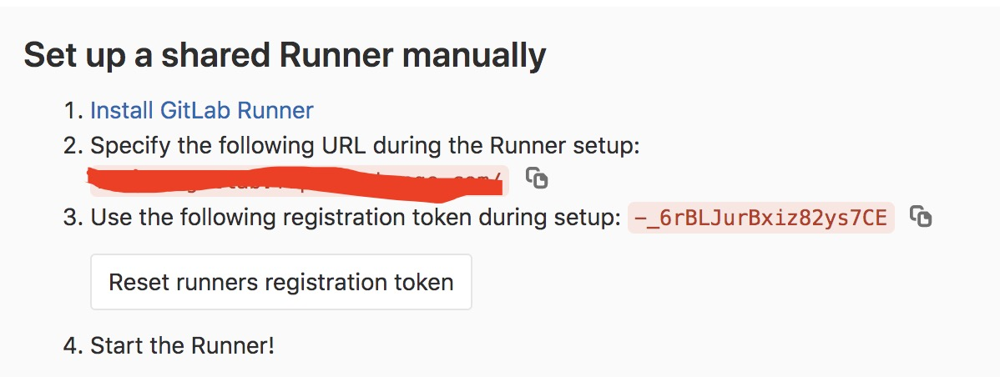
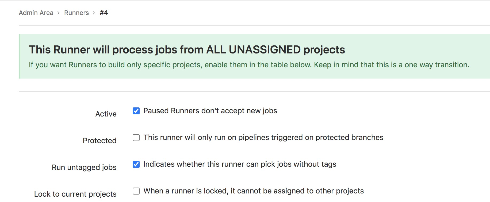

### 搭建gitlab并使用CICD部署HelloWorld

#### 搭建gitlab

> 购买一个域名 不备案也可以 最好备案了
```angular2html
docker run --detach \
    --hostname gitlab.frp.?.com \
    --env GITLAB_OMNIBUS_CONFIG="external_url 'http://gitlab.frp.?.com:8099/'; gitlab_rails['gitlab_shell_ssh_port'] = 6022;gitlab_rails['gitlab_port'] = 8099;" \
    --publish 443:443 --publish 8099:8099 --publish 6022:22 \
    --name gitlab \
    --restart always \
    --volume /home/?/data/gitlab/:/etc/gitlab \
    --volume /home/?/data/gitlab/log:/var/log/gitlab \
    --volume /home/?/data/gitlab/data:/var/opt/gitlab \
 gitlab/gitlab-ce:11.8.1-ce.0
```

1.  ssh 用6022 http 使用8099 非80端口 当然网站备案了也可以用80端口
2. hostname 使用你购买的域名 比如 gitlab.frp.?.cn
3. 命令的？ 号是你要替换的域名,volume 需要你自定义你的映射本地地址
4. 方向代理后的最终地址为 gitlab.frp.?.cn:8099

> 可以先看使用frp代理本地机器到公网教程后在 回来学习下面CI教程

> root 进入gitlab 页面 http://gitlab.frp.?.com/admin/runners


#### 部署gitlab-runner

```angularjs
docker run -d --name gitlab-runner --restart always \
-v /home/?/data/gitlab-runner/config:/etc/gitlab-runner \
-v /run/docker.sock:/var/run/docker.sock \
gitlab/gitlab-runner:latest
```
>  注册

```angularjs
docker exec -it gitlab-runner gitlab-ci-multi-runner register

```
> 根据你的地址和token 注册 选择docker方式(企业级应当kubernetes shell等基本过时的废物不要用)
```angularjs
Please enter the gitlab-ci coordinator URL:
    http://?.com/
Please enter the gitlab-ci token for this runner:
    ?
Please enter the gitlab-ci description for this runner:
    commonh-runner
Please enter the gitlab-ci tags for this runner (comma separated):
    common
Whether to run untagged builds [true/false]:
    true
Please enter the executor: docker, parallels, shell, kubernetes, docker-ssh, ssh, virtualbox, docker+machine, docker-ssh+machine:
    docker 
Please enter the default Docker image (e.g. ruby:2.1):
    registry.cn-hangzhou.aliyuncs.com/xianbei_jdk/centos_jdk8:v1.2
```

> 配置可以不需要tag 运行


> 修改/home/?/data/gitlab-runner/config 下config.toml 配置maven npm缓存 地址可以改成本地的url

```angularjs
[[runners]]
  name = "common"
  url = "http://192.168.0.?:8099/"
  token = "?"
  executor = "docker"
  [runners.custom_build_dir]
  [runners.cache]
    [runners.cache.s3]
    [runners.cache.gcs]
  [runners.docker]
    tls_verify = false
    image = "registry.cn-hangzhou.aliyuncs.com/xianbei_jdk/centos_jdk8:v1.2"
    privileged = false
    disable_entrypoint_overwrite = false
    oom_kill_disable = false
    disable_cache = false
    volumes =  ["/root/.npm:/root/.npm", "/root/.ssh:/root/.ssh", "/root/.sonar:/root/.sonar", "/root/.m2:/root/.m2", "/root/deploy:/root/deploy", "/var/run/docker.sock:/var/run/docker.sock", "/cache"]
    pull_policy = "if-not-present"
    shm_size = 0
```

#### 部署helloworld
项目下添加.gitlab-ci.yml 参考项目
> [https://github.com/VonChange/deploy-file](https://github.com/VonChange/deploy-file)
> [https://github.com/VonChange/hello-world](https://github.com/VonChange/hello-world)

master分支是 deploy-file项目把通用文件放到gitlab-runner挂载文件夹内 做到部署配置通用
all-in-code 是配置在同一项目内 可参考 不推荐使用


