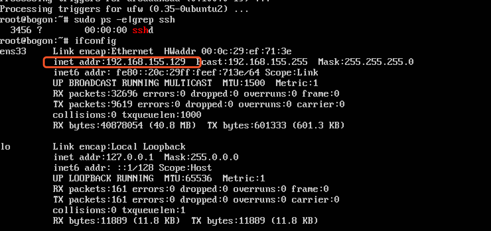

### 搭建ubuntu server及其k8s
搭建ubuntu server 参考: [https://www.jianshu.com/p/da49cd69e8ff](https://www.jianshu.com/p/da49cd69e8ff)

1. 我已经安装过了 没留啥文档 基本按照安装ubuntu server参考安装即可 这里只说自己踩过的坑
2. 我安装的版本是 ubuntu server 16.04.6 安装语言必须选择English 也就是第一个安装界面 
但在 "Welcome" 语言选择界面可以选择中文(只是安装界面的语言) 但第一个我尝试过选择中文 是有问题 当然能力足够最好都选择英文
3. 双系统 磁盘分区选择手动  选择一个你预备好的非系统ntfs盘(在win10里最好格式化过) 删除此分区变为空闲分区 选择该空闲分区自动分区 确定执行

### 搭建 本地k8s准备工作
1. 必须安装了ssh 安装的ubuntu的时候可选 没选也简单 自己安装即可
 
```bash
sudo ps -e |grep ssh  # 查看时候安装过
apt-get update 
apt-get install openssh-server # 不存在 安装
```

2. 必须创建root用户 
 
```bash
sudo passwd root # 设置root的密码
su root #来测试是否可以进入root用户，如果出现#说明已经设置root用户的密码成功
```
3. 必须设置ssh root用户可以登录(默认没有开启)

```bash
# 其配置在 sshd_config文件中，进行编辑：
vi /etc/ssh/sshd_config
```
```angular2html
 #找到PermitRootLogin 添加一行 PermitRootLogin yes，如下：
 # Authentication:
#LoginGraceTime 2m
#PermitRootLogin prohibit-password
PermitRootLogin yes
#StrictModes yes
#MaxAuthTries 6
#MaxSessions 10
```
```bash
#保存退出后，重启ssh服务，输入命令：  
/etc/init.d/ssh restart
```

4. ifconfig 查看ip



5. 这里推荐使用secureCRT(secureFX) ssh root登录

6. 准备就绪 可以安装k8s了

#### 搭建 本地k8s（懒人法)

1. 搭建k8s网上有多种 比如kubeadmin 但因为墙的问题 需要爬许多坑 
2. 这里推荐使用：[kubeasz](https://github.com/easzlab/kubeasz) 里面文档也很丰富清晰，对于初学者来说很有帮助。最主要的是不需要翻墙 
3. 我主要拿 主机做开发服务器 只有一个服务器 也就是只有master 所以选择最简单的 [单机快速体验k8s集群的测试环境--AllinOne部署](https://github.com/easzlab/kubeasz/blob/master/docs/setup/quickStart.md)
4. 安装上面教程安装即可 很简单 但前提必须ssh root能登录(没开之前 老是安装不上)
5. 还有先不要着急安装 我安装后发现一个问题 [使用2.0.3版本后，在dashboard中看不到CPU、MEM]https://github.com/easzlab/kubeasz/issues/666
6. 在教程AllinOne部署2.下载文件后 在服务器上提前在roles/kube-node/templates/kubelet-config.yaml.j2文件中把 readOnlyPort: 0 改成 readOnlyPort: 10255 再执行部署
7. 现在你已经安装好了k8s 可以动手各种kubectl命令 好记性不如烂笔头 可以动手学习k8s还有docker

#### 配置docker镜像加速


